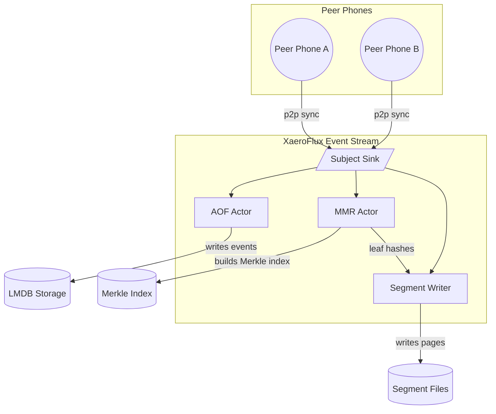

# Xaeroflux

⚠️ **Work in progress – NOT READY FOR PRODUCTION USE** ⚠️

## Introduction

Xaeroflux is a mobile-optimized, decentralized append-only event store and indexing engine powering truly cloud-less, peer-to-peer applications. It provides:

* **Reactive pipelines** via a lightweight `Subject` + chainable `map`/`filter` operators
* **Zero-copy envelopes** (`XaeroEvent` wrapping your raw `Vec<u8>` payload + optional Merkle proof)
* **Append-Only Log (AOF)** → fixed-size mmap-backed pages → per-page Merkle trees → Merkle Mountain Range (MMR)
* **Pluggable sync**: built-in Iroh gossip/blob + MMR-peak diff, Libp2p/QUIC/WebRTC/Tor
* **Priority streams**: you choose topics; system/identity streams can be fanned out separately

---

## Core Types & API



```rust
use std::sync::Arc;
use crossbeam::channel::unbounded;
use xaeroflux::{Subject, XaeroEvent, ThreadPerSubjectMaterializer};

// 1) Create a new topic/Subject
let posts = Subject::new("posts".into());

// 2) Optionally chain operators (no threads yet!):
let pipeline = posts
    .map(|mut xe| { xe.evt.data.push(b'!'); xe })      // append “!”
    .filter(|xe| xe.evt.data.len() > 2)               // drop small payloads
    .filter_merkle_proofs();                          // only keep proofed events

// 3) Materialize with a strategy (one thread per Subject here):
let _sub = pipeline.subscribe_with(
    ThreadPerSubjectMaterializer::new(),
    move |xe: XaeroEvent| {
        println!("final payload = {:?}", xe.evt.data);
    },
);

// 4) Publish events into the pipeline
let raw = b"hello".to_vec();
let evt = XaeroEvent { evt: Event::new(raw.clone(), 0), merkle_proof: Some(vec![0]) };
posts.sink.tx.send(evt).unwrap();
```

### `XaeroEvent`

```rust
pub struct XaeroEvent {
    pub evt:          Event<Vec<u8>>,   // your raw app data + metadata
    pub merkle_proof: Option<Vec<u8>>,  // inclusion proof if already indexed
}
```

### `Subject`

* **`Subject::new(name)`**
  Creates a new (hot) multicast channel: returns an `Arc<Subject>`.
* **`subject.map(f)`**, **`.filter(p)`**, **`.filter_merkle_proofs()`**, **`.blackhole()`**
  Chainable, lazy—only records your operator list.
* **`subject.sink.tx.send(xe)`**
  Push a `XaeroEvent` into the pipeline.
* **`subject.subscribe_with(mat, handler)`**
  Picks a `Materializer` to run your ops + callback in one thread (or pool).

### `ThreadPerSubjectMaterializer`

A built-in `Materializer` that:

1. Spawns exactly *one* thread
2. `recv()`s from your `Subject`’s input channel
3. Applies all operators in order
4. Calls your final `FnMut(XaeroEvent)` for each event that survives the pipeline

You can write your own `Materializer` (shared pool, async runtime, etc.) by implementing:

```rust
pub trait Materializer {
  fn materialize(
    &self,
    subject: Arc<Subject>,
    handler: Box<dyn FnMut(XaeroEvent) + Send>,
  ) -> Subscription;
}
```

---

## Architecture Overview

```ascii
┌─────────────── Your App ────────────────┐
│ • encode domain events as Vec<u8>       │
│ • wrap in XaeroEvent, push to Subject   │
│ • pick pipeline with map/filter/etc.    │
│ • subscribe_with(materializer, handler) │
└──────────────────┬──────────────────────┘
                   │
┌──────────────────▼────────────────────────┐
│            Xaeroflux Public API           │
│  Subject + chainable ops + Materializer  │
└──────────────────┬────────────────────────┘
                   │
┌──────────────────▼────────────────────────┐
│             System Layer (hidden)        │
│ • AOF (LMDB) → pages → per-page Merkle   │
│ • MMR live indexer + .unsafe_run()       │
│ • Iroh gossip/blob sync actor            │
└───────────────────────────────────────────┘
```

---

## Publishing & Scanning

* **Live**:

  ```rust
  let sub = Subject::new("feed".into());
  let _h = sub.subscribe_with(mat, |xe| { ... });
  sub.sink.tx.send(xe).unwrap();
  ```
* **Historical** (once we add `.scan` / `.replay`):

  ```rust
  for xe in xf.scan("feed", since_ts, until_ts) {
    println!("history: {:?}", xe.evt.data);
  }
  // or push history back into the same Subject via sink
  xf.replay("feed", since_ts, until_ts, &sub.sink);
  ```

---

## Testing & Quality

```bash
# Run the Subject + Materializer unit tests
cargo test -- --nocapture

# Lint & format
cargo fmt --all
cargo clippy --all -- -D warnings
```

---

## Contributing

1. Fork & branch
2. Add or update tests & docs
3. Open a PR
4. Iterate with feedback

See [CONTRIBUTING.md](CONTRIBUTING.md) for details.

---

## License

Mozilla Public License 2.0
See [LICENSE](LICENSE) for full text.
