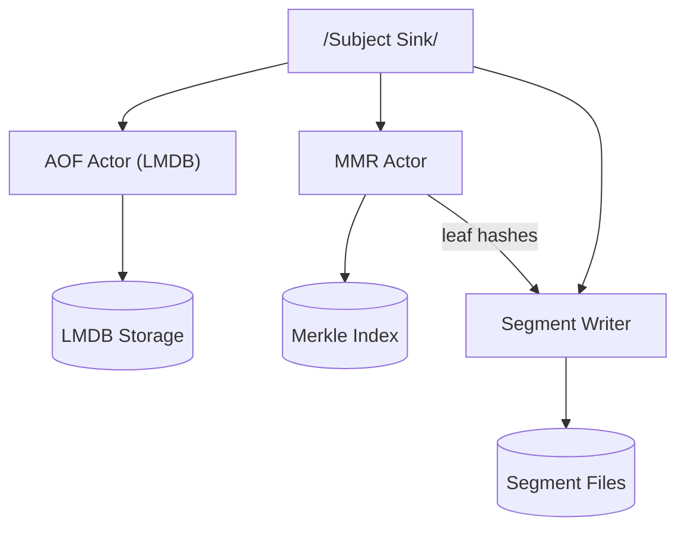

# Xaeroflux

⚠️ **Work in progress – NOT READY FOR PRODUCTION USE** ⚠️

Xaeroflux is an Rx-like distributed, decentralized, peer-to-peer Merkle-Index based append only mmap/paged event store
enables engineers and decentralized App enthusiasts in creating event driven, asynchronous, highly scalable decentralized
Rx style app backends transparently handling peer to peer syncs efficiently.

---

## Table of Contents

1. [Introduction](#introduction)
2. [Key Concepts](#key-concepts)
3. [Subject API](#subject-api)
4. [Materializers](#materializers)
5. [Example: “Posts” Pipeline](#example-posts-pipeline)
6. [System Actors & Storage](#system-actors--storage)
7. [Testing & Quality](#testing--quality)
8. [Contributing](#contributing)
9. [License](#license)

---

## Introduction

Xaeroflux is a **mobile-optimized**, **decentralized** event-stream engine built around:

* **Reactive pipelines**: hot `Subject` sources + chainable `map`/`filter` operators
* **Zero-copy envelopes**: `XaeroEvent` wrapping your `Event<Vec<u8>>` payload
* **Efficient on-disk AOF** → fixed-size mmap pages → per-page Merkle proofs → global MMR index
* **Pluggable sync**: gossip/blob sync, libp2p/QUIC/WebRTC, custom peer strategies

It enables truly cloud-less, peer-to-peer applications where every device can produce, consume, and verify event streams.

---

## Key Concepts

* **Subject**: a named, multicast event source. You `.send()` into it and any number of subscribers will process your data through a pipeline of operators.
* **XaeroEvent**: the envelope around your domain `Event<Vec<u8>>`, including an optional Merkle proof.
* **Operator chain**: lazy list of transformations (`map`, `filter`, `filter_merkle_proofs`, `blackhole`, etc.) that get applied in order at subscription time.
* **Materializer**: the runtime that drives operators + your final callback—e.g. one thread per Subject, or a shared thread-pool.
* **System Actors**: the background AOF writer, MMR indexer, and segment file writer that persist and index your event history.

---

## Subject API

```rust
use std::sync::Arc;
use xaeroflux::{Subject, XaeroEvent};

// 1) Create a hot Subject for topic "chat"
let chat_subject: Arc<Subject> = Subject::new("chat".into());

// 2) Build an operator chain (no threads yet)
let chat_pipeline = chat_subject
    .map(|mut xe| {
        // annotate or mutate the event
        xe.evt.data.extend(b" 🌟");
        xe
    })
    .filter(|xe| !xe.evt.data.is_empty())
    .filter_merkle_proofs()   // drop any events lacking a valid proof
    .blackhole_if(|xe| xe.evt.data.starts_with(b"ignore"));

// 3) Subscribe with your handler and a Materializer
let _subscription = chat_pipeline.subscribe_with(
    xaeroflux::ThreadPerSubjectMaterializer::new(),
    move |xe: XaeroEvent| {
        println!("Chat message: {:?}", String::from_utf8_lossy(&xe.evt.data));
    },
);

// 4) Publish events into the pipeline
let raw = b"hello".to_vec();
let evt = XaeroEvent {
    evt: xaeroflux::core::event::Event::new(raw, 0),
    merkle_proof: None,
};
chat_subject.sink().send(evt).unwrap();
```

### `XaeroEvent`

```rust
pub struct XaeroEvent {
    pub evt:          Event<Vec<u8>>,   // your app payload + metadata
    pub merkle_proof: Option<Vec<u8>>,  // optional Merkle inclusion proof
}
```

### `Subject`

* **`Subject::new(name: String) -> Arc<Subject>`**
  Creates a new hot multicast channel identified by `name`.

* **Operators** (lazy, recorded until `.subscribe_with()`):

  * `.map(fn: FnMut(XaeroEvent) -> XaeroEvent)`
  * `.filter(fn: Fn(&XaeroEvent) -> bool)`
  * `.filter_merkle_proofs()`
  * `.blackhole_if(fn: Fn(&XaeroEvent) -> bool)`
  * `.scan(start_ts, end_ts)` & `.replay()` (coming soon)

* **Publishing**

  ```rust
  subject.sink().send(xe).unwrap();
  ```

* **Subscribing**

  ```rust
  subject.subscribe_with(materializer, handler_fn);
  ```

---

## Materializers

A **Materializer** drives the operator chain and your final handler.

```rust
pub trait Materializer {
    fn materialize(
        &self,
        subject: Arc<Subject>,
        handler: Box<dyn FnMut(XaeroEvent) + Send>,
    ) -> Subscription;
}
```

### Provided Implementations

* **`ThreadPerSubjectMaterializer`**

  * Spawns one dedicated thread
  * `recv()`s from the subject’s channel
  * Applies all operators, then invokes your handler

You can implement your own—e.g. use a shared thread-pool or an async runtime.

---

## Example: “Posts” Pipeline

```rust
use xaeroflux::{
    Subject,
    ThreadPerSubjectMaterializer,
    XaeroEvent,
};
use xaeroflux::core::event::Event;

// Create “posts” subject
let posts = Subject::new("posts".into());

// Chain ops: add “!” and drop tiny posts
let pipeline = posts
    .map(|mut xe| { xe.evt.data.push(b'!'); xe })
    .filter(|xe| xe.evt.data.len() > 2);

// Subscribe
let _sub = pipeline.subscribe_with(
    ThreadPerSubjectMaterializer::new(),
    |xa| {
        println!("📬 Got post: {:?}", xa.evt.data);
    },
);

// Publish
let raw = b"hi".to_vec();
let xa = XaeroEvent {
    evt: Event::new(raw, 0),
    merkle_proof: None,
};
posts.sink().send(xa).unwrap();
```

---

## System Actors & Storage

Under the hood, every `Subject` push also fans out to these background actors:



* **AOF Actor**: writes zero-copy archived events into LMDB.
* **MMR Actor**: Merkle-indexer building a live MMR for your stream.
* **Segment Writer**: pages archived events into fixed-size mmap files with per-page Merkle proofs.

Sync is pluggable—default uses Iroh gossip/blob.

---

## Testing & Quality

```bash
# Run all unit/integration tests with logs
cargo test -- --nocapture

# Enforce formatting
cargo fmt --all -- --check

# Lint
cargo clippy --all -- -D warnings
```

We exercise both the Subject API and the underlying storage/rollover logic in automated tests.

---

## Contributing

1. **Fork & branch.**
2. **Add/update tests & docs.**
3. **Open a PR.**
4. **Iterate with maintainers.**

See [CONTRIBUTING.md](CONTRIBUTING.md) for more details.

---

## License

This project is licensed under the **Mozilla Public License 2.0**.
See [LICENSE](LICENSE) for full text.
